# MIMIC-III vs MIMIC-IV: Dataset Comparison Summary

> **Generated from:** `mimic_analysis/compute_part1.py` (Part 1) · `mimic_analysis/build_patient_table2.py` (Part 2)
> **Pipeline:** `build_mimic3_wide.py` · `build_mimic4_wide.py`

---

## Part 1: Wide-Table Overview (All ICU Stays)

**Inclusion:** All ICU stays; one row per stay. All statistics computed over `hr ≥ 0` rows only.

### Definitions

**Time axis.** Both datasets extend to pre-ICU hours (negative `hr`):

| | MIMIC-III | MIMIC-IV |
|---|---|---|
| Pre-ICU window | `hr = −12` to discharge | `hr = −24` to discharge |
| Reason for difference | Official `pivoted_lab.sql` uses a ±12 h fuzzy window; labs up to 12 h before admission map to `hr = 0`, so extending beyond −12 produces empty rows | `labevents` is queried by raw `charttime` with no restriction, enabling capture of labs up to 24 h before ICU admission |

For `hr < 0`, ICU-sourced variables (vitals, GCS, vasopressors, urine output, ventilation, SOFA, SepsisLabel) are NULL by construction; only hospital laboratory values may be non-null.

**SOFA score.** Computed hourly for `hr ≥ 0`. Each of the six components (respiration, coagulation, liver, cardiovascular, CNS, renal) is scored from raw values at the current hour (no carry-forward), then the maximum over the preceding 24 hours is taken (`MAX(score) OVER ROWS BETWEEN 24 PRECEDING AND CURRENT ROW`). `sofa_24hours` = sum of the six 24 h-max component scores.

**Sepsis label.**

| | MIMIC-III | MIMIC-IV |
|---|---|---|
| Suspected infection | Antibiotic + culture within [−24 h, +12 h] | Antibiotic + culture within [−48 h, +24 h] |
| Sepsis criterion | SOFA rise ≥ 2 from 24 h rolling minimum (`sofa_delta_24h ≥ 2`) | Absolute SOFA ≥ 2 (`sofa_24hours ≥ 2`) |
| Reference | Seymour et al. 2016 / MIMIC-III Sepsis Challenge | Singer et al. 2016 / mimic-code `sepsis3.sql` |

`SepsisLabel = 1` from `onset_hr` onward within the stay; `= 0` before onset; `= NULL` for `hr < 0`. A stay is classified as a **sepsis stay** if `SepsisLabel = 1` at any `hr ≥ 0`.

**ICU LOS:** `MAX(hr)` per stay (hours from admission to discharge). **Coverage rate:** proportion of stays with ≥ 1 non-null value for the variable at `hr = 0`.

---

### Table 1. Dataset Characteristics

| | MIMIC-III | MIMIC-IV |
|---|---:|---:|
| **Scale** | | |
| Total ICU stays | 52,361 | 94,437 |
| Unique subjects | 38,343 | 65,365 |
| Total patient-hours (hr ≥ 0) | 5,133,428 | 8,219,121 |
| ICU LOS, mean (h) | 97.0 | 86.0 |
| ICU LOS, median [IQR] (h) | 49.0 [27.0, 98.0] | 46.0 [24.0, 92.0] |
| LOS < 24 h, % | 19.1% | 23.2% |
| Hospital mortality, n (%) | 6,407 (12.2%) | 11,347 (12.0%) |
| **Sepsis** | | |
| Sepsis stays, n (%) | 16,026 (30.6%) | 41,296 (43.7%) |
| Non-sepsis stays, n (%) | 36,335 (69.4%) | 53,141 (56.3%) |
| Sepsis subjects, n (%) | 13,161 (34.3%) | 31,911 (48.8%) |
| Sepsis onset, median [IQR] (h) | 2 [1, 11] | 1 [0, 3] |
| **SOFA** | | |
| Max SOFA per stay, mean | 4.5 | 4.8 |
| Max SOFA per stay, median [IQR] | 4 [2, 6] | 4 [2, 7] |
| Max SOFA ≥ 2, % of stays | 80.6% | 81.9% |
| Max SOFA ≥ 6, % of stays | 31.2% | 34.6% |
| SOFA at sepsis onset, median [IQR] | 2 [1, 4] | 3 [2, 4] |
| SOFA Δ at sepsis onset (III only), median [IQR] | 1 [0, 2] | — |

### Table 2. First ICU Unit by Volume

| ICU Unit | MIMIC-III | MIMIC-IV |
|---|---:|---:|
| Medical Intensive Care Unit (MICU) | — | 20,699 (21.9%) |
| MICU | 20,644 (39.4%) | — |
| Medical/Surgical Intensive Care Unit (MICU/SICU) | — | 15,445 (16.4%) |
| Cardiac Vascular Intensive Care Unit (CVICU) | — | 14,765 (15.6%) |
| Surgical Intensive Care Unit (SICU) | — | 13,007 (13.8%) |
| Coronary Care Unit (CCU) | — | 10,773 (11.4%) |
| Trauma SICU (TSICU) | — | 10,472 (11.1%) |
| CSRU | 9,154 (17.5%) | — |
| SICU | 8,724 (16.7%) | — |
| CCU | 7,572 (14.5%) | — |
| TSICU | 6,267 (12.0%) | — |
| Neuro Intermediate | — | 5,775 (6.1%) |
| Neuro Surgical Intensive Care Unit (Neuro SICU) | — | 1,751 (1.9%) |

### Table 3. Clinical Data Coverage at hr = 0 (% of stays with ≥ 1 non-null value)

| Variable | MIMIC-III | MIMIC-IV |
|---|---:|---:|
| Heart rate | 98.4% | 88.4% |
| Systolic BP | 96.9% | 84.3% |
| Temperature | N/A (not in wide table) | 62.5% |
| SpO₂ | 96.2% | 86.0% |
| Creatinine | 18.8% | 20.6% |
| Platelet | 18.5% | 21.5% |
| Bilirubin (total) | 6.3% | 6.8% |
| GCS total | 54.2% | 43.8% |
| PaO₂ | 18.8% | 16.2% |
| FiO₂ | 10.4% | 8.6% |

† Temperature is not available as a standalone vital in the MIMIC-III wide table (arterial blood gas temperature only).

---


### Table 4. Sepsis Onset Hour Distribution (Sepsis Stays Only)

Onset hour = first `hr` at which `SepsisLabel = 1` (always ≥ 0; consistent across
both datasets). Each sepsis stay contributes exactly one value.

| Dataset | Sepsis Stays | Mean (hr) | Median (hr) | P25 (hr) | P75 (hr) | SD | Min (hr) | Max (hr) |
| --- | ---: | ---: | ---: | ---: | ---: | ---: | ---: | ---: |
| MIMIC-III | 16,026 | 19.23 | 2.0 | 1.0 | 11.0 | 50.97 | 0 | 1277 |
| MIMIC-IV  | 41,296 | 6.63 | 1.0 | 0.0 | 3.0 | 50.2 | 0 | 8769 |

### Key Observations

#### 1. Sepsis rate: MIMIC-IV (43.7%) > MIMIC-III (30.6%)

The difference is driven by the **labelling criterion**, not a genuinely higher prevalence of sepsis.

MIMIC-III applies a delta criterion (SOFA rise ≥ 2 from a 24 h rolling minimum), which does not label patients who arrive critically ill and do not deteriorate further. As a result, the median SOFA at sepsis onset is **2 [1, 4]**, indicating that most flagged patients experienced a rise from a low baseline rather than an acute decompensation. MIMIC-IV applies an absolute criterion (SOFA ≥ 2 at time of suspected infection), capturing patients admitted with an already-elevated SOFA; their median onset SOFA is **3 [2, 4]**.

The clinical severity of the labelled cohorts is nearly identical across datasets (first-day SOFA median 5.0 [3.0, 7.0]; 30-day mortality 20.9% vs 20.3%), confirming that the additional labels in MIMIC-IV represent patients missed by the structural blind spot of the delta criterion — those who arrive critically ill but do not deteriorate further — rather than a milder case mix.

#### 2. Vitals coverage: MIMIC-IV (~55%) > MIMIC-III (~41%) at hr = 0

The gap reflects a documentation system transition: MIMIC-III was recorded primarily through CareVue (manual nursing entry), whereas MIMIC-IV transitioned to MetaVision (automated bedside monitor downloads), which captures vitals at higher frequency and completeness.

#### 3. SOFA means aligned: MIMIC-III (4.5) ≈ MIMIC-IV (4.8)

Prior to correction, the MIMIC-III mean max SOFA was 8.3. The root cause was a structural defect in the renal SOFA urine-output logic, described in detail below.

---

### In-Depth Analysis: Systematic Bias in Early Renal SOFA Scoring

#### Core Conclusion

When extracting the Renal SOFA score for the first 48 hours of an ICU admission, there is a massive gap between MIMIC-III and MIMIC-IV. Tracing the underlying SQL confirms: this is not a local data extraction bug, but a **severe boundary truncation defect in MIMIC-III's official script when handling cumulative metrics (urine output)**. The defect was structurally resolved in MIMIC-IV through an observation-time-aware mechanism.

#### I. Empirical Evidence: Systematic False Positives in MIMIC-III

| ICU Hours Elapsed | MIMIC-III (Score = 4) | MIMIC-IV (Score = 4) | Observation |
|:---|:---:|:---:|:---|
| hr = 0 | 5.4% | 0.5% | IV reflects true baseline of severe renal failure. |
| hr = 6 | **44.6% (peak)** | — | III false positives peak; nearly half of patients deemed anuric. |
| hr = 24 | 49.5% | 5.2% | IV completes first full 24 h window; ratio is stable. |
| hr = 48 | **8.6% (sudden drop)** | 7.5% | III exits the flawed rolling window; drops back to normal. |

**The absolute driver: urine output (UO).** In MIMIC-III, 84.1% of abnormally high renal scores (≥ 2) are driven by UO alone:

- Pure UO trigger: **62.9%** — creatinine is normal; the patient is penalized solely by the UO logic.
- Pure creatinine trigger: 19.9%.

#### II. Defect Origin: Flaw in MIMIC-III's Official Script

The root cause lies in `pivoted_sofa.sql`. A fixed row-based window is applied blindly, producing two compounding errors: **early boundary truncation** and **extreme-value propagation**.

For snapshot metrics (respiration, coagulation), taking the min or max over 24 hours is unaffected by how long the patient has been in the ICU. Urine output is a **cumulative metric** requiring `SUM` — truncated sums produce systematically wrong totals.

**MIMIC-III official `pivoted_sofa.sql`:**

```sql
-- Root cause: mechanical 24-row backward rolling window
SUM(UrineOutput) OVER (
    PARTITION BY icustay_id
    ORDER BY hr
    ROWS BETWEEN 23 PRECEDING AND CURRENT ROW  -- sums whatever rows exist, regardless of actual time span
) AS uo_24hr
```

**Error chain:**

1. **Truncated comparison** — At hr = 6 the engine finds only 7 rows. Normal urine over 7 hours (~400 mL) is compared directly against the 24 h clinical threshold (< 500 mL = score 3).
2. **False-positive explosion** — Seven hours of urine can rarely meet a 24 h passing mark; healthy kidneys are mass-classified as severely oliguric in the early hours.
3. **Ghost propagation** — The final SOFA uses `MAX(sofa_renal) OVER 24 PRECEDING`. A spuriously generated score of 4 at hr = 7 propagates forward for 24 hours, exiting the window completely only at hr = 48 — explaining the abrupt drop above.

#### III. The Fix: Observation-Time-Aware Logic in MIMIC-IV

MIMIC-IV's `sofa.sql` introduces `uo_tm_24hr` (accumulated observation duration) and refuses to score until the window is sufficiently covered.

**MIMIC-IV official `sofa.sql`:**

```sql
MAX(
    CASE
        -- Refuse to evaluate if observation window < 22 h
        WHEN uo.uo_tm_24hr >= 22 AND uo.uo_tm_24hr <= 30
        -- Normalise to a standard 24 h equivalent
        THEN uo.urineoutput_24hr / uo.uo_tm_24hr * 24
    END
) AS uo_24hr
```

During the first ~22 hours, `uo_24hr` is forcibly NULL — no UO-driven score is possible. The scoring engine falls back entirely to admission serum creatinine, which is why MIMIC-IV shows a realistic 0.5% severe-failure rate at hr = 0. This logic was ported into the MIMIC-III pipeline (`build_mimic3_wide.py`, step07_uo), after which both datasets align: max SOFA mean 4.5 (III) vs 4.8 (IV).

---

## Part 2: Patient-Level Cohort Summary

**Inclusion:** One row per patient, first ICU stay only.

**Definitions:**
- **SOFA:** first-day maximum SOFA score
- **SIRS:** first-day maximum SIRS score
- **Comorbidity index:** Elixhauser van Walraven score (MIMIC-III, official mimic-code ICD-9 implementation) / Charlson Comorbidity Index with age adjustment (MIMIC-IV, official mimic-code ICD-9 + ICD-10 implementation). *Scores are not directly comparable across datasets.*
- **Mechanical ventilation:** any invasive/non-invasive ventilation or tracheostomy during the first ICU stay
- **30-day mortality:** measured from first ICU admission time
- **Race/ethnicity:** grouped into 7 categories (White, Black, Hispanic, Asian, Native, Other, Unknown)

### Table 5. MIMIC-III Patient Characteristics

| Variable | All patients (N = 38,343 (100.0%)) | Survivors (N = 33,979 (88.6%)) | Non-survivors (N = 4,364 (11.4%)) | P-value (Survival) | Sepsis (N = 10,990 (28.7%)) | Non-sepsis (N = 27,353 (71.3%)) | P-value (Sepsis) |
| --- | --- | --- | --- | --- | --- | --- | --- |
| Age (y) [Q1-Q3] | 66.0 [52.0, 78.0] | 65.0 [52.0, 77.0] | 74.0 [61.0, 83.0] | <0.001 | 67.0 [54.0, 79.0] | 65.0 [52.0, 77.0] | <0.001 |
| Male, n (%) | 21711 (56.6%) | 19413 (57.1%) | 2298 (52.7%) | <0.001 | 6428 (58.5%) | 15283 (55.9%) | <0.001 |
| BMI (kg/m^2), mean +/- SD | 39.5 +/- 977.2 | 40.6 +/- 1034.0 | 30.7 +/- 110.3 | 0.170 | 48.5 +/- 1390.9 | 35.1 +/- 692.6 | 0.407 |
| Race, n (%) |  |  |  | <0.001 |  |  | <0.001 |
|   White | 27370 (71.4%) | 24391 (71.8%) | 2979 (68.3%) |  | 7969 (72.5%) | 19401 (70.9%) |  |
|   Black | 2937 (7.7%) | 2687 (7.9%) | 250 (5.7%) |  | 873 (7.9%) | 2064 (7.5%) |  |
|   Hispanic | 1247 (3.3%) | 1162 (3.4%) | 85 (1.9%) |  | 335 (3.0%) | 912 (3.3%) |  |
|   Asian | 903 (2.4%) | 802 (2.4%) | 101 (2.3%) |  | 271 (2.5%) | 632 (2.3%) |  |
|   Native | 20 (0.1%) | 19 (0.1%) | 1 (0.0%) |  | 5 (0.0%) | 15 (0.1%) |  |
|   Other | 1036 (2.7%) | 931 (2.7%) | 105 (2.4%) |  | 329 (3.0%) | 707 (2.6%) |  |
|   Unknown | 4830 (12.6%) | 3987 (11.7%) | 843 (19.3%) |  | 1208 (11.0%) | 3622 (13.2%) |  |
| Comorbidity index [Q1-Q3] | 5.0 [0.0, 12.0] | 5.0 [0.0, 11.0] | 11.0 [5.0, 17.0] | <0.001 | 9.0 [4.0, 16.0] | 5.0 [0.0, 10.0] | <0.001 |
| SIRS first-day max [Q1-Q3] | 3.0 [2.0, 3.0] | 3.0 [2.0, 3.0] | 3.0 [2.0, 4.0] | <0.001 | 3.0 [2.0, 4.0] | 2.0 [2.0, 3.0] | <0.001 |
| SOFA first-day [Q1-Q3] | 3.0 [1.0, 5.0] | 2.0 [1.0, 4.0] | 5.0 [3.0, 8.0] | <0.001 | 5.0 [3.0, 7.0] | 2.0 [1.0, 4.0] | <0.001 |
| ICU length-of-stay (d) [Q1-Q3] | 2.0 [1.0, 4.0] | 2.0 [1.0, 4.0] | 3.0 [1.0, 7.0] | <0.001 | 4.0 [2.0, 9.0] | 2.0 [1.0, 3.0] | <0.001 |
| Mechanical ventilation, n (%) | 19473 (50.8%) | 16263 (47.9%) | 3210 (73.6%) | <0.001 | 7576 (68.9%) | 11897 (43.5%) | <0.001 |
| 30-day mortality, n (%) | 5204 (13.6%) | 1074 (3.2%) | 4130 (94.6%) | <0.001 | 2293 (20.9%) | 2911 (10.6%) | <0.001 |
| Hospital mortality, n (%) | 4364 (11.4%) | 0 (0.0%) | 4364 (100.0%) | <0.001 | 2041 (18.6%) | 2323 (8.5%) | <0.001 |

### Table 6. MIMIC-IV Patient Characteristics

| Variable | All patients (N = 65,365 (100.0%)) | Survivors (N = 58,279 (89.2%)) | Non-survivors (N = 7,086 (10.8%)) | P-value (Survival) | Sepsis (N = 27,890 (42.7%)) | Non-sepsis (N = 37,475 (57.3%)) | P-value (Sepsis) |
| --- | --- | --- | --- | --- | --- | --- | --- |
| Age (y) [Q1-Q3] | 66.0 [54.0, 78.0] | 66.0 [54.0, 77.0] | 73.0 [61.0, 83.0] | <0.001 | 67.0 [56.0, 78.0] | 65.0 [53.0, 77.0] | <0.001 |
| Male, n (%) | 36719 (56.2%) | 32877 (56.4%) | 3842 (54.2%) | <0.001 | 16160 (57.9%) | 20559 (54.9%) | <0.001 |
| BMI (kg/m^2), mean +/- SD | 29.2 +/- 7.8 | 29.3 +/- 7.7 | 29.1 +/- 7.9 | 0.320 | 29.7 +/- 8.1 | 28.7 +/- 7.4 | <0.001 |
| Race, n (%) |  |  |  | <0.001 |  |  | <0.001 |
|   White | 43093 (65.9%) | 38990 (66.9%) | 4103 (57.9%) |  | 18257 (65.5%) | 24836 (66.3%) |  |
|   Black | 6016 (9.2%) | 5470 (9.4%) | 546 (7.7%) |  | 2366 (8.5%) | 3650 (9.7%) |  |
|   Hispanic | 2351 (3.6%) | 2177 (3.7%) | 174 (2.5%) |  | 952 (3.4%) | 1399 (3.7%) |  |
|   Asian | 1981 (3.0%) | 1769 (3.0%) | 212 (3.0%) |  | 817 (2.9%) | 1164 (3.1%) |  |
|   Native | 127 (0.2%) | 117 (0.2%) | 10 (0.1%) |  | 59 (0.2%) | 68 (0.2%) |  |
|   Other | 2416 (3.7%) | 2183 (3.7%) | 233 (3.3%) |  | 1012 (3.6%) | 1404 (3.7%) |  |
|   Unknown | 9381 (14.4%) | 7573 (13.0%) | 1808 (25.5%) |  | 4427 (15.9%) | 4954 (13.2%) |  |
| Comorbidity index [Q1-Q3] | 4.0 [2.0, 7.0] | 4.0 [2.0, 6.0] | 6.0 [4.0, 8.0] | <0.001 | 5.0 [3.0, 7.0] | 4.0 [2.0, 6.0] | <0.001 |
| SIRS first-day max [Q1-Q3] | 2.0 [1.0, 2.0] | 2.0 [1.0, 2.0] | 2.0 [2.0, 3.0] | <0.001 | 2.0 [2.0, 3.0] | 2.0 [1.0, 2.0] | <0.001 |
| SOFA first-day [Q1-Q3] | 3.0 [2.0, 6.0] | 3.0 [1.0, 5.0] | 6.0 [4.0, 10.0] | <0.001 | 5.0 [3.0, 7.0] | 2.0 [1.0, 4.0] | <0.001 |
| ICU length-of-stay (d) [Q1-Q3] | 1.9 [1.1, 3.7] | 1.9 [1.1, 3.5] | 2.7 [1.1, 6.4] | <0.001 | 2.9 [1.5, 6.3] | 1.5 [0.9, 2.5] | <0.001 |
| Mechanical ventilation, n (%) | 28444 (43.5%) | 23589 (40.5%) | 4855 (68.5%) | <0.001 | 17521 (62.8%) | 10923 (29.1%) | <0.001 |
| 30-day mortality, n (%) | 8970 (13.7%) | 2208 (3.8%) | 6762 (95.4%) | <0.001 | 5672 (20.3%) | 3298 (8.8%) | <0.001 |
| Hospital mortality, n (%) | 7086 (10.8%) | 0 (0.0%) | 7086 (100.0%) | <0.001 | 4710 (16.9%) | 2376 (6.3%) | <0.001 |

---

*† Elixhauser van Walraven score (MIMIC-III): 29-condition weighted index based on secondary ICD-9 diagnoses (Quan et al. 2005; van Walraven et al. 2009). Scores range from approximately −19 to +89; higher scores indicate greater predicted in-hospital mortality risk. Negative weights apply to certain conditions (e.g., drug abuse −7, obesity −4).*

*‡ Charlson Comorbidity Index with age adjustment (MIMIC-IV): 17-condition index based on ICD-9 and ICD-10 diagnoses (Charlson et al. 1987; Quan et al. 2011). Age contributes 0–4 points (1 point per decade above age 50). Scores range from 0 to approximately 30; higher scores indicate greater comorbidity burden. The two comorbidity indices are not directly comparable.*

---

---

---

## Part 4: Subject-Level ICU Stay Patterns

> **Unit of analysis:** one row per unique subject (first vs. subsequent stays). Sepsis label per stay = 1 if `SepsisLabel = 1` at any `hr >= 0` within that stay, else 0.

---

### 4.1 Distribution of ICU Stays per Subject

MIMIC-III: **38,343** unique subjects - 8,140 (21.2%) have more than one ICU stay.  
MIMIC-IV: **65,365** unique subjects - 16,229 (24.8%) have more than one ICU stay.

*All non-sepsis* = all stays for this subject are labelled 0; *All sepsis* = all stays labelled 1; *Mixed* = at least one 0 and at least one 1 across stays.

**MIMIC-III**

| ICU stays | Subjects, n (%) | Cumulative (%) | All non-sepsis | All sepsis | Mixed |
|---:|---:|---:|---:|---:|---:|
| 1 | 30,203 (78.8%) | 78.8% | 21,880 (72.4%) | 8,323 (27.6%) | 0 (0.0%) |
| 2 | 5,368 (14.0%) | 92.8% | 2,614 (48.7%) | 706 (13.2%) | 2,048 (38.2%) |
| 3 | 1,511 (3.9%) | 96.7% | 485 (32.1%) | 120 (7.9%) | 906 (60.0%) |
| 4 | 623 (1.6%) | 98.3% | 133 (21.3%) | 34 (5.5%) | 456 (73.2%) |
| 5 | 281 (0.7%) | 99.1% | 44 (15.7%) | 13 (4.6%) | 224 (79.7%) |
| 6 | 142 (0.4%) | 99.4% | 12 (8.5%) | 1 (0.7%) | 129 (90.8%) |
| 7 | 76 (0.2%) | 99.6% | 10 (13.2%) | 0 (0.0%) | 66 (86.8%) |
| 8 | 39 (0.1%) | 99.7% | 0 (0.0%) | 0 (0.0%) | 39 (100.0%) |
| 9 | 25 (0.1%) | 99.8% | 1 (4.0%) | 0 (0.0%) | 24 (96.0%) |
| 10 | 23 (0.1%) | 99.9% | 0 (0.0%) | 0 (0.0%) | 23 (100.0%) |
| >=11 | 52 (0.1%) | 100.0% | 3 (5.8%) | 0 (0.0%) | 49 (94.2%) |

**MIMIC-IV**

| ICU stays | Subjects, n (%) | Cumulative (%) | All non-sepsis | All sepsis | Mixed |
|---:|---:|---:|---:|---:|---:|
| 1 | 49,136 (75.2%) | 75.2% | 28,829 (58.7%) | 20,307 (41.3%) | 0 (0.0%) |
| 2 | 10,331 (15.8%) | 91.0% | 3,722 (36.0%) | 2,351 (22.8%) | 4,258 (41.2%) |
| 3 | 3,204 (4.9%) | 95.9% | 648 (20.2%) | 480 (15.0%) | 2,076 (64.8%) |
| 4 | 1,291 (2.0%) | 97.9% | 167 (12.9%) | 131 (10.1%) | 993 (76.9%) |
| 5 | 578 (0.9%) | 98.7% | 40 (6.9%) | 44 (7.6%) | 494 (85.5%) |
| 6 | 308 (0.5%) | 99.2% | 22 (7.1%) | 13 (4.2%) | 273 (88.6%) |
| 7 | 158 (0.2%) | 99.5% | 5 (3.2%) | 5 (3.2%) | 148 (93.7%) |
| 8 | 110 (0.2%) | 99.6% | 7 (6.4%) | 5 (4.5%) | 98 (89.1%) |
| 9 | 56 (0.1%) | 99.7% | 3 (5.4%) | 2 (3.6%) | 51 (91.1%) |
| 10 | 52 (0.1%) | 99.8% | 2 (3.8%) | 1 (1.9%) | 49 (94.2%) |
| >=11 | 141 (0.2%) | 100.0% | 9 (6.4%) | 1 (0.7%) | 131 (92.9%) |

---

### 4.2 Sepsis Sequence Patterns

Each subject's ICU stays are ordered by admission time and collapsed to a binary sepsis label per stay (0 = no sepsis, 1 = sepsis), then concatenated into a sequence such as `0->1->0`. Proportion within group = share among all subjects with the same number of ICU stays. The `1 stay`, `2 stays`, `3 stays`, and `4 stays` sections are mutually exclusive subject subgroups rather than nested subsets.

MIMIC-III: **294** unique sequences in total (30 with <=4 stays).  
MIMIC-IV: **512** unique sequences in total (30 with <=4 stays).

#### MIMIC-III

#### Sequences with 1-4 ICU Stays (all combinations)

| n stays | Sequence | Subjects, n | % within group |
|---:|---|---:|---:|
| 1 | `0` | 21,880 | 72.4% |
| 1 | `1` | 8,323 | 27.6% |
| 2 | `0->0` | 2,614 | 48.7% |
| 2 | `0->1` | 1,067 | 19.9% |
| 2 | `1->0` | 981 | 18.3% |
| 2 | `1->1` | 706 | 13.2% |
| 3 | `0->0->0` | 485 | 32.1% |
| 3 | `0->0->1` | 218 | 14.4% |
| 3 | `1->0->0` | 169 | 11.2% |
| 3 | `0->1->0` | 159 | 10.5% |
| 3 | `1->0->1` | 134 | 8.9% |
| 3 | `0->1->1` | 124 | 8.2% |
| 3 | `1->1->1` | 120 | 7.9% |
| 3 | `1->1->0` | 102 | 6.8% |
| 4 | `0->0->0->0` | 133 | 21.3% |
| 4 | `0->0->0->1` | 62 | 10.0% |
| 4 | `0->0->1->0` | 46 | 7.4% |
| 4 | `1->0->0->0` | 45 | 7.2% |
| 4 | `0->0->1->1` | 39 | 6.3% |
| 4 | `0->1->0->0` | 39 | 6.3% |
| 4 | `1->0->0->1` | 37 | 5.9% |
| 4 | `1->1->1->1` | 34 | 5.5% |
| 4 | `0->1->0->1` | 31 | 5.0% |
| 4 | `1->0->1->1` | 27 | 4.3% |
| 4 | `1->1->1->0` | 25 | 4.0% |
| 4 | `0->1->1->0` | 24 | 3.9% |
| 4 | `1->1->0->1` | 22 | 3.5% |
| 4 | `0->1->1->1` | 20 | 3.2% |
| 4 | `1->0->1->0` | 20 | 3.2% |
| 4 | `1->1->0->0` | 19 | 3.0% |

#### Sequences with >=5 ICU Stays (summary)

| n stays | Subjects | Unique patterns | Most common sequence | Count |
|---:|---:|---:|---|---:|
| 5 | 281 | 32 | `0->0->0->0->0` | 44 |
| 6 | 142 | 54 | `0->0->0->0->0->0` | 12 |
| 7 | 76 | 47 | `0->0->0->0->0->0->0` | 10 |
| 8 | 39 | 35 | `0->0->0->0->0->0->1->0` | 2 |
| 9 | 25 | 25 | `0->0->0->0->0->0->0->0->0` | 1 |
| 10 | 23 | 21 | `0->0->0->0->0->0->0->0->0->1` | 2 |
| 11 | 8 | 8 | `0->0->0->0->0->0->1->1->0->0->1` | 1 |
| 12 | 9 | 8 | `0->0->0->0->0->0->0->0->0->0->0->0` | 2 |
| 13 | 10 | 9 | `0->0->0->0->0->0->0->0->0->1->0->0->1` | 2 |
| 14 | 5 | 5 | `0->0->0->0->0->0->0->1->0->1->1->0->0->0` | 1 |
| 15 | 4 | 4 | `0->0->0->0->0->0->0->0->0->0->1->0->1->0->0` | 1 |
| 16 | 1 | 1 | `1->1->1->1->0->1->1->1->0->1->0->1->1->0->0->1` | 1 |
| 17 | 2 | 2 | `0->0->0->0->0->0->0->0->0->0->0->1->0->0->0->0->0` | 1 |
| 18 | 2 | 2 | `0->0->0->0->0->0->0->1->0->0->0->1->0->0->0->0->0->0` | 1 |
| 19 | 1 | 1 | `0->1->0->1->0->0->1->0->1->0->0->0->1->1->0->1->1->0->1` | 1 |
| 21 | 2 | 2 | `0->0->0->0->0->0->0->1->0->0->0->0->0->0->0->0->0->1->0->0->0` | 1 |
| 22 | 1 | 1 | `0->0->1->1->0->0->1->0->0->0->1->1->0->0->1->0->1->0->1->1->0->1` | 1 |
| 23 | 1 | 1 | `0->0->0->0->0->1->0->0->0->0->0->1->0->0->0->1->0->0->0->0->0->0->0` | 1 |
| 24 | 1 | 1 | `0->0->0->0->0->1->0->0->0->0->0->0->1->0->0->0->0->0->1->0->1->0->1->0` | 1 |
| 25 | 1 | 1 | `1->0->0->0->1->1->0->0->0->1->0->0->0->0->0->0->0->1->0->0->0->0->0->0->1` | 1 |
| 30 | 1 | 1 | `0->0->0->0->0->0->0->0->0->0->0->0->0->0->0->0->0->0->0->0->0->0->0->0->0->0->0->0->0->0` | 1 |
| 35 | 1 | 1 | `0->0->0->0->0->0->0->0->1->0->0->0->0->0->0->0->0->0->0->0->0->0->0->0->0->0->0->1->0->0->0->0->0->0->0` | 1 |
| 38 | 1 | 1 | `0->0->0->0->0->0->0->1->1->0->0->0->1->0->1->0->1->0->0->0->0->0->0->0->0->0->0->0->0->0->1->0->0->0->1->0->0->0` | 1 |
| 41 | 1 | 1 | `0->0->1->0->0->0->0->0->1->0->0->0->0->0->0->0->0->0->1->0->0->0->1->0->0->0->0->0->0->0->0->1->1->0->0->0->1->0->0->0->0` | 1 |

#### MIMIC-IV

#### Sequences with 1-4 ICU Stays (all combinations)

| n stays | Sequence | Subjects, n | % within group |
|---:|---|---:|---:|
| 1 | `0` | 28,829 | 58.7% |
| 1 | `1` | 20,307 | 41.3% |
| 2 | `0->0` | 3,722 | 36.0% |
| 2 | `1->1` | 2,351 | 22.8% |
| 2 | `1->0` | 2,215 | 21.4% |
| 2 | `0->1` | 2,043 | 19.8% |
| 3 | `0->0->0` | 648 | 20.2% |
| 3 | `1->1->1` | 480 | 15.0% |
| 3 | `1->0->0` | 422 | 13.2% |
| 3 | `0->0->1` | 361 | 11.3% |
| 3 | `1->0->1` | 353 | 11.0% |
| 3 | `1->1->0` | 340 | 10.6% |
| 3 | `0->1->1` | 308 | 9.6% |
| 3 | `0->1->0` | 292 | 9.1% |
| 4 | `0->0->0->0` | 167 | 12.9% |
| 4 | `1->1->1->1` | 131 | 10.1% |
| 4 | `1->0->1->1` | 93 | 7.2% |
| 4 | `0->0->0->1` | 90 | 7.0% |
| 4 | `1->0->0->0` | 81 | 6.3% |
| 4 | `1->0->0->1` | 81 | 6.3% |
| 4 | `1->1->0->1` | 79 | 6.1% |
| 4 | `0->1->0->0` | 75 | 5.8% |
| 4 | `1->1->0->0` | 72 | 5.6% |
| 4 | `0->0->1->0` | 67 | 5.2% |
| 4 | `0->0->1->1` | 67 | 5.2% |
| 4 | `0->1->1->1` | 67 | 5.2% |
| 4 | `1->1->1->0` | 64 | 5.0% |
| 4 | `0->1->0->1` | 57 | 4.4% |
| 4 | `0->1->1->0` | 53 | 4.1% |
| 4 | `1->0->1->0` | 47 | 3.6% |

#### Sequences with >=5 ICU Stays (summary)

| n stays | Subjects | Unique patterns | Most common sequence | Count |
|---:|---:|---:|---|---:|
| 5 | 578 | 32 | `1->1->1->1->1` | 44 |
| 6 | 308 | 62 | `0->0->0->0->0->0` | 22 |
| 7 | 158 | 78 | `0->0->0->0->0->0->0` | 5 |
| 8 | 110 | 73 | `0->0->0->0->0->0->0->0` | 7 |
| 9 | 56 | 49 | `0->0->0->0->0->0->0->0->0` | 3 |
| 10 | 52 | 51 | `0->0->0->0->0->0->0->0->0->0` | 2 |
| 11 | 43 | 40 | `0->0->0->0->0->0->0->0->0->0->0` | 4 |
| 12 | 20 | 20 | `0->0->0->0->0->0->0->0->0->0->0->0` | 1 |
| 13 | 17 | 17 | `0->0->0->0->0->0->0->1->0->0->0->0->0` | 1 |
| 14 | 6 | 6 | `0->0->0->1->0->1->0->0->1->0->0->1->1->0` | 1 |
| 15 | 10 | 10 | `0->0->0->0->0->0->0->0->0->0->0->0->0->0->0` | 1 |
| 16 | 9 | 9 | `0->0->1->0->0->0->0->0->0->0->1->1->0->1->1->1` | 1 |
| 17 | 4 | 4 | `0->0->1->1->1->0->0->0->0->0->1->1->1->0->0->1->1` | 1 |
| 18 | 11 | 10 | `0->0->0->0->0->0->0->0->0->0->0->0->0->0->0->0->0->0` | 2 |
| 19 | 2 | 2 | `0->0->0->0->1->0->0->1->1->1->1->1->1->0->0->0->0->0->1` | 1 |
| 20 | 3 | 3 | `0->0->0->0->0->0->0->0->0->0->0->0->0->0->0->0->0->0->0->0` | 1 |
| 22 | 3 | 3 | `0->0->0->0->0->1->0->0->0->0->0->0->0->0->0->0->0->0->0->0->0->1` | 1 |
| 24 | 3 | 3 | `0->0->0->0->0->0->1->1->1->0->0->0->0->0->0->1->0->0->1->0->0->1->0->1` | 1 |
| 25 | 3 | 3 | `0->0->0->0->1->1->0->0->1->0->0->0->0->0->1->0->0->0->0->0->1->0->0->1->1` | 1 |
| 26 | 1 | 1 | `0->0->0->0->0->1->0->0->0->0->0->0->0->0->0->0->0->0->0->0->0->0->0->0->0->0` | 1 |
| 27 | 1 | 1 | `0->0->0->0->0->1->0->1->0->0->0->0->0->0->0->0->0->1->1->0->0->1->0->0->1->0->1` | 1 |
| 30 | 1 | 1 | `0->0->0->0->0->0->0->0->0->0->0->0->0->0->0->1->0->0->0->0->0->1->0->1->1->0->1->1->0->1` | 1 |
| 31 | 1 | 1 | `1->1->0->0->0->1->0->0->0->1->0->0->1->1->1->1->1->0->0->0->1->0->0->0->0->0->0->0->0->1->0` | 1 |
| 34 | 1 | 1 | `0->0->0->0->0->0->0->0->0->1->0->0->0->0->0->0->0->0->0->0->0->0->0->0->0->1->0->0->0->0->0->0->0->0` | 1 |
| 37 | 1 | 1 | `1->1->0->1->1->0->0->0->0->0->0->0->0->0->0->1->0->0->0->0->0->0->0->0->0->0->0->0->0->0->0->0->0->1->0->0->0` | 1 |
| 41 | 1 | 1 | `1->0->0->1->1->1->1->1->0->1->1->1->1->1->1->0->1->1->1->1->1->0->1->1->1->0->1->1->1->1->1->1->1->0->1->1->1->1->1->1->1` | 1 |

#### Visual Summary

The figure below groups subjects by their total number of ICU stays and shows the most common sequence patterns within each subgroup. Colors separate all-non-sepsis, mixed, and all-sepsis trajectories.

| MIMIC-III | MIMIC-IV |
|---|---|
| 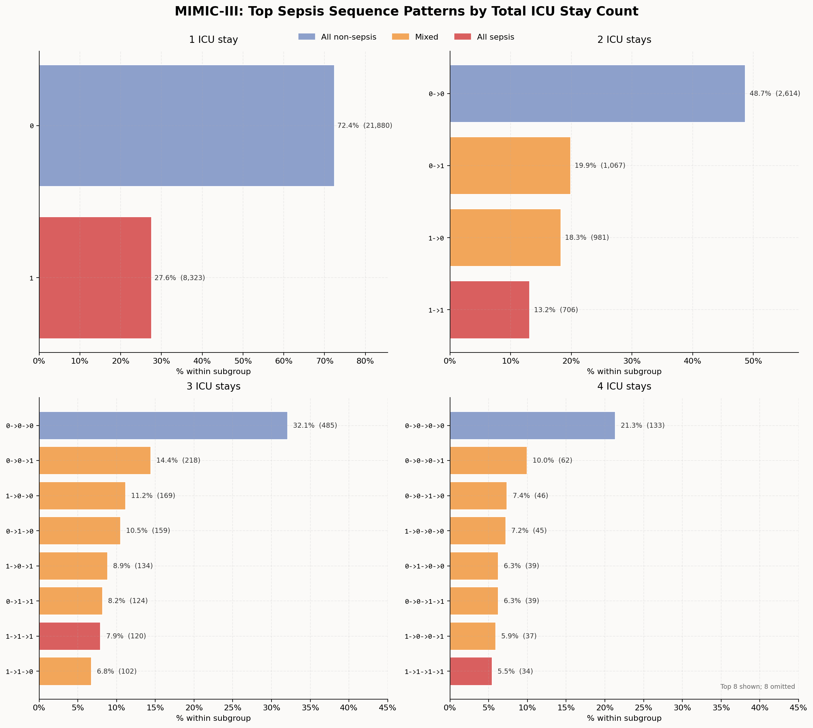 | 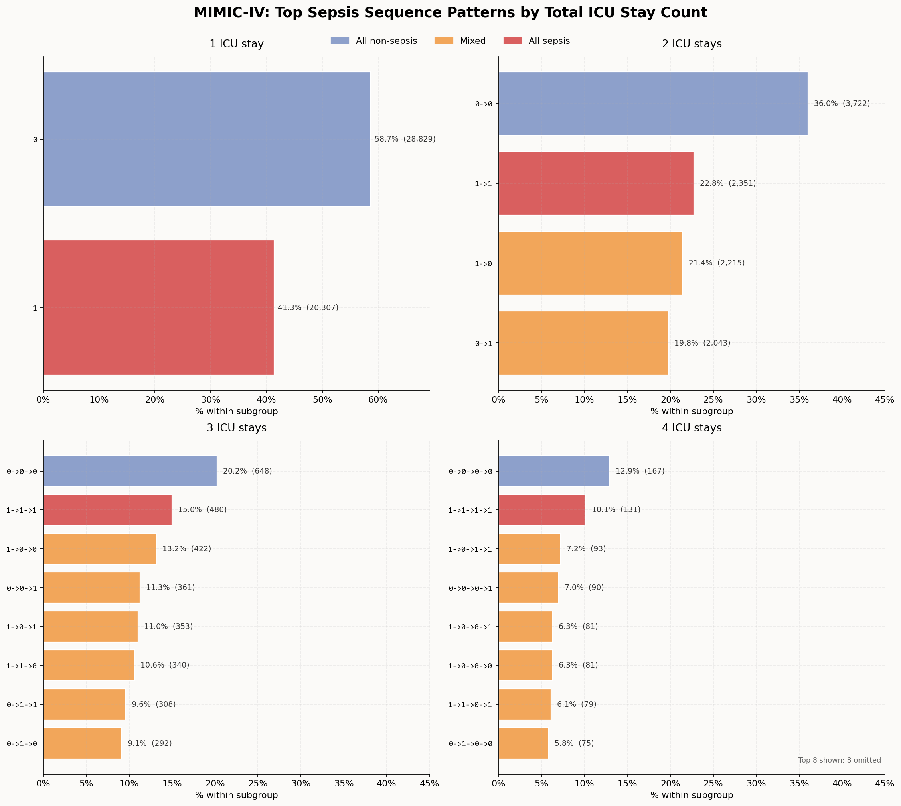 |

## Part 5: Graphical Summaries across ICU Stay

> All figures use 3-hour time bins. Source script: `mimic_analysis/plot_icu_curves.py`.

---

### 5.1 Active ICU Stays over Time

Each curve shows the number of stays still ongoing at a given ICU hour. Non-sepsis stays discharge earlier, while sepsis stays persist longer and gradually make up a larger share of the remaining ICU population.

| MIMIC-III | MIMIC-IV |
|---|---|
| 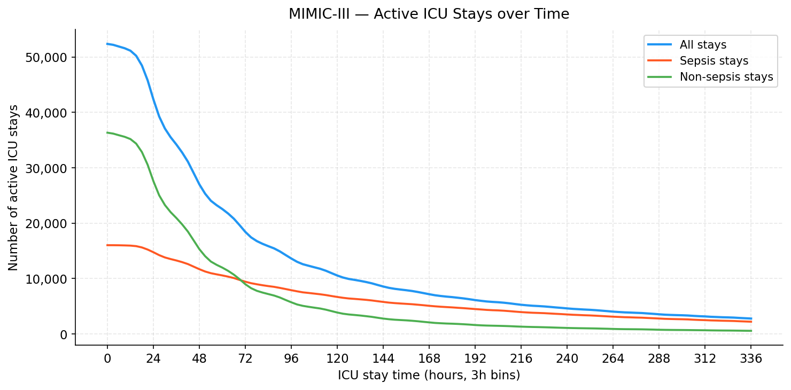 | 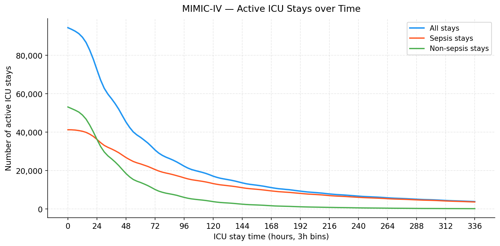 |

---

### 5.2 Sepsis Prevalence among Active Stays

At each hour `t`, the curve shows the percentage of still-active stays whose sepsis onset has already occurred. The monotonic increase reflects both accumulating onsets and earlier discharge among non-sepsis stays.

| MIMIC-III | MIMIC-IV |
|---|---|
| 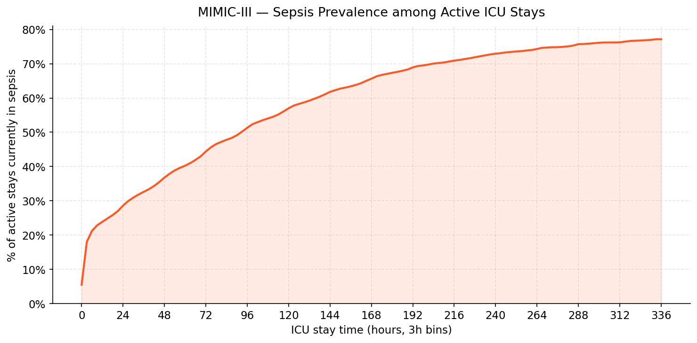 | 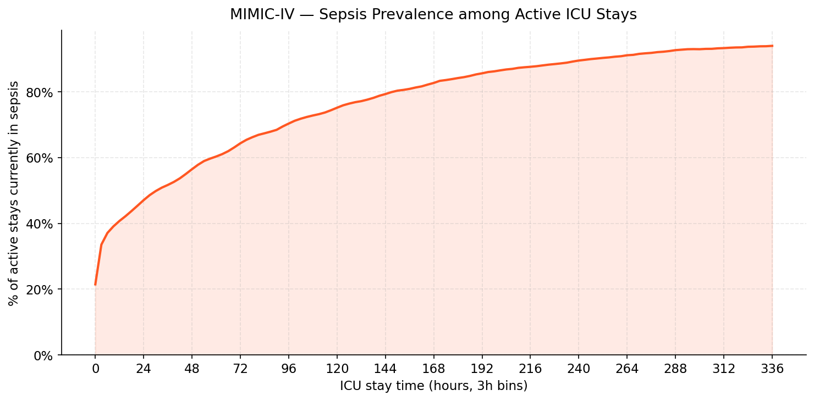 |

---

### 5.3 Mean SOFA Score over ICU Stay

Mean SOFA is computed at each 3-hour bin across all stays still active at that time, stratified by sepsis status. Sepsis stays maintain a consistently higher SOFA trajectory in both datasets.

| MIMIC-III | MIMIC-IV |
|---|---|
| 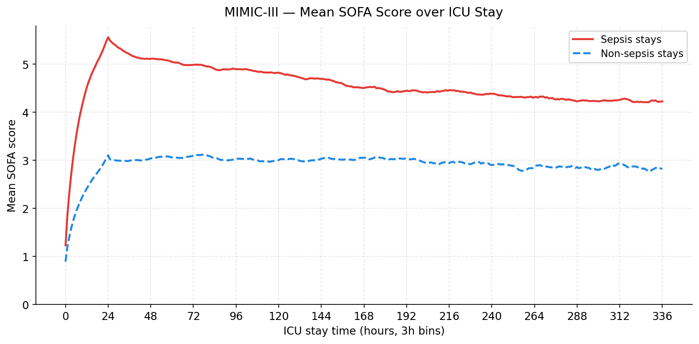 | 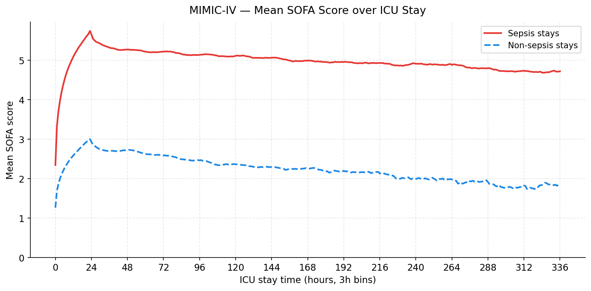 |

---

### 5.4 In-Hospital Death Timing

The histogram shows when in-hospital deaths occur relative to ICU admission, approximated by the last recorded ICU hour for each death stay. The dashed curve shows cumulative deaths over ICU time.

| MIMIC-III | MIMIC-IV |
|---|---|
| 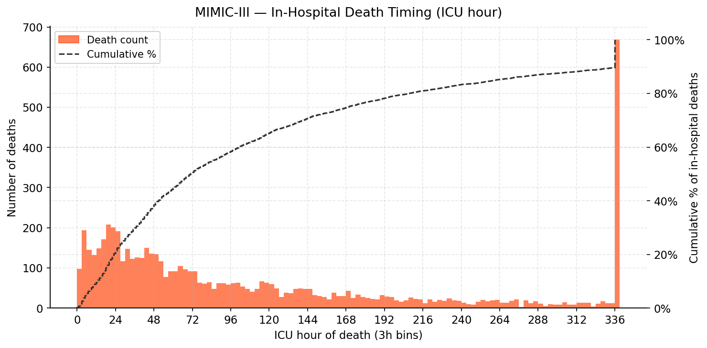 | 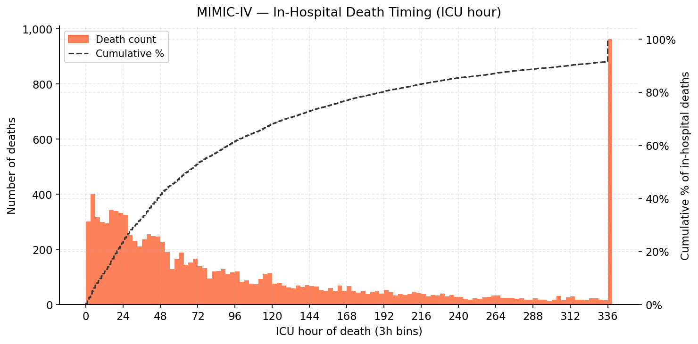 |

---

### 5.5 Vasopressor Use Rate over ICU Stay

The y-axis shows the percentage of currently active stays receiving any vasopressor at each 3-hour bin. Sepsis stays have consistently higher vasopressor exposure in both cohorts.

| MIMIC-III | MIMIC-IV |
|---|---|
| 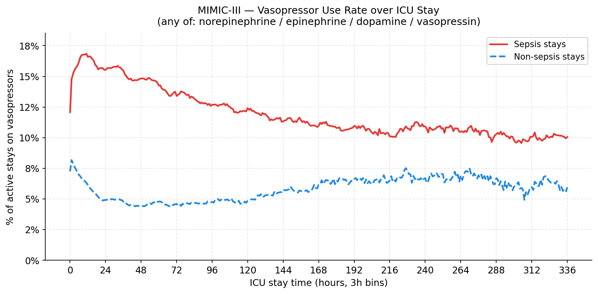 | 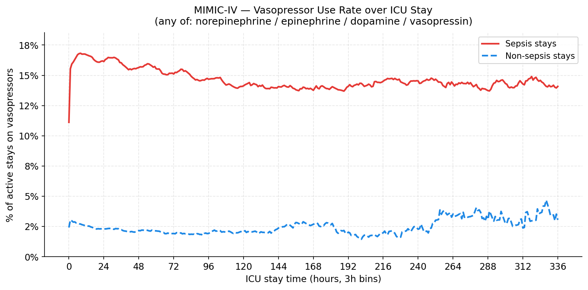 |

---

## Part 6: ICU Stay Exclusion Flow

Starting from the raw PhysioNet source files, the pipeline applies two sequential filters
before building the hourly wide table. Steps with zero exclusions are omitted.

### MIMIC-III (source: `ICUSTAYS.csv`, version 1.4)

| Item | Remaining stays | Removed | Filter condition |
| --- | ---: | ---: | --- |
| All ICU stays in source database | 61,532 | — | Full dataset |
| Exclude paediatric patients | 53,362 | −8,170 | Age < 18 years at ICU admission (predominantly neonates: 8,071 of 8,170) |
| Exclude admissions without ICU charting | 52,894 | −468 | `has_chartevents_data = 0` in `ADMISSIONS`; no ICU monitoring record exists |
| Exclude stays without a heart-rate record | 52,361 | −533 | No entry in `CHARTEVENTS` with itemid 211 (CareVue) or 220045 (MetaVision); time axis cannot be anchored |
| **Final wide table** | **52,361** | **−9,171 total** | — |

### MIMIC-IV (source: `icu/icustays.csv.gz`, version 3.1)

| Item | Remaining stays | Removed | Filter condition |
| --- | ---: | ---: | --- |
| All ICU stays in source database | 94,458 | — | Full dataset (MIMIC-IV is adults-only by dataset design; age < 18 = 0) |
| Exclude stays without a heart-rate record | 94,437 | −21 | No entry in `chartevents` with itemid 220045; time axis cannot be anchored |
| **Final wide table** | **94,437** | **−21 total** | — |

### Notes

- The heart-rate anchor (`intime_hr`) defines `hr = 0` for the entire time axis. A stay with no heart-rate record cannot be placed on the hourly grid and is therefore excluded entirely.
- MIMIC-III uses two heart-rate itemids (211 = CareVue, 220045 = MetaVision); MIMIC-IV is MetaVision-only (220045).
- MIMIC-III's `has_chartevents_data` flag is a pre-computed column in `ADMISSIONS` that marks admissions with at least one chartevent record. Stays failing this check have no ICU monitoring data at all.

---

### Pending Exclusion Decisions

| # | Item | Question |
| --- | --- | --- |
| 1 | Pre-ICU rows (`hr < 0`) | Should all pre-ICU rows be dropped from the wide table entirely, or retained as context features? |
| 2 | Stays whose sepsis label depends on pre-ICU data | If pre-ICU rows are removed, any stay where the suspicion window (`si_starttime`) begins before ICU admission relies on pre-ICU data to set `SepsisLabel`. Should these stays be excluded, or relabelled using only in-ICU data? |
| 3 | Stays with incomplete 24 h SOFA window | The SOFA rolling window is truncated for the first ~24 h of any stay. Should stays shorter than 24 h (or whose only sepsis-eligible window falls within the first 24 h) be excluded to avoid boundary artefacts? |
| 4 | Early-onset stays (onset ≤ 24 h or ≤ 48 h) | Per the last meeting, stays with sepsis onset within 24 h (or 48 h) of ICU admission may warrant exclusion. Decision may depend on patient source (ED vs. ward vs. OR transfer) — needs verification of admission source distribution before finalising the threshold. |
